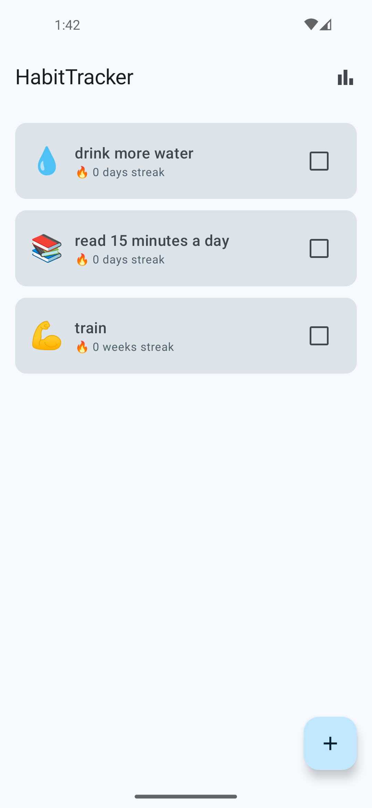
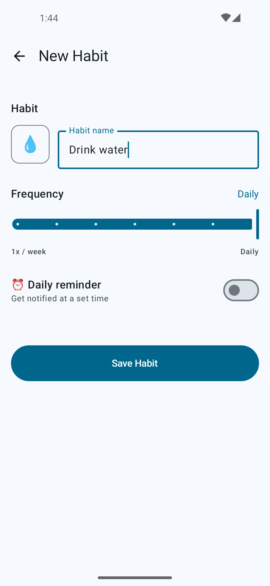
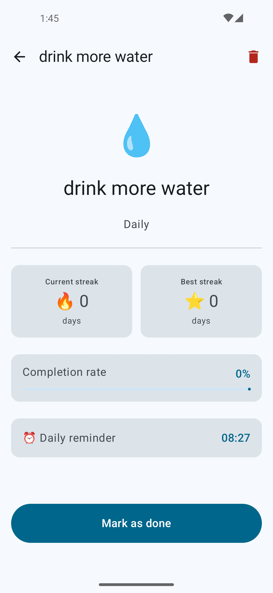
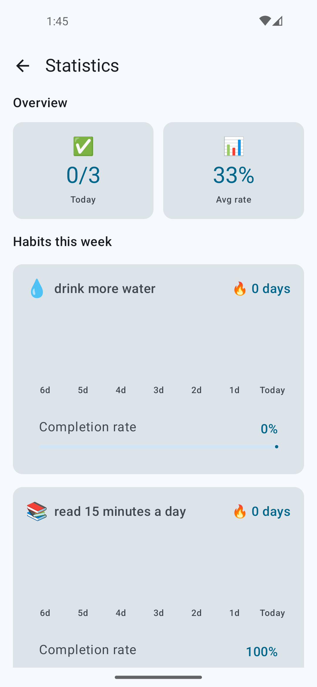

# HabitTracker 🎯

A production-grade Android habit tracker built to demonstrate clean architecture, modern Jetpack Compose UI, and engineering practices used in professional Android development.

> Kotlin · Jetpack Compose · MVI · Clean Architecture · Room · WorkManager · Hilt

---

## Table of Contents

1. [Product Overview](#product-overview)
2. [Screenshots](#screenshots)
3. [Architecture](#architecture)
4. [Technical Decisions](#technical-decisions)
5. [System Design Considerations](#system-design-considerations)
6. [Engineering Highlights](#engineering-highlights)
7. [Project Structure](#project-structure)
8. [Local Development](#local-development)
9. [Testing](#testing)
10. [Future Improvements](#future-improvements)
11. [Tech Stack](#tech-stack)

---

## Product Overview

### Problem

Habit formation research consistently shows that tracking creates accountability. Most habit trackers are either too simple (binary daily checklists) or too complex (full productivity suites). HabitTracker targets the gap: a focused, offline-first tool that enforces consistency without overwhelming users.

### Target Users

People who want to build routines — whether exercising 3x per week, reading daily, or meditating before sleep. Designed for the user who wants a lightweight, honest mirror of their own consistency.

### Business Value

- **Offline-first** — all data lives on device. No account, no backend, no friction.
- **Streak integrity** — streak calculation is grounded in actual completion data, not self-reporting.
- **Reminder reliability** — notifications scheduled via WorkManager survive process death and device reboots.
- **Duplicate protection** — completing the same habit twice in a day is rejected at the domain layer, not the UI.

---

## Screenshots

<p align="center">
  
  &nbsp;&nbsp;
  
  &nbsp;&nbsp;
  
  &nbsp;&nbsp;
  
</p>

## Architecture

### Overview

The application follows **Clean Architecture** with three explicitly separated layers. Each layer has a single responsibility and depends only on the layer below it.

```
┌─────────────────────────────────┐
│        Presentation Layer       │  Compose · MVI · ViewModels
├─────────────────────────────────┤
│          Domain Layer           │  Pure Kotlin · Use Cases · Entities
├─────────────────────────────────┤
│           Data Layer            │  Room · DataStore · WorkManager
└─────────────────────────────────┘
```

### MVI Pattern

Each screen follows a strict **Model-View-Intent** contract:

| Artifact | Type | Role |
|---|---|---|
| `*State` | `data class` | Single source of truth — the entire UI is a function of this value |
| `*Action` | `sealed interface` | Every possible user intent — the UI may only communicate through these |
| `*Event` | `sealed interface` | One-time side-effects (navigation, snackbar) delivered via `Channel` |

`StateFlow` carries state (survives recomposition). `Channel` carries events (consumed exactly once, no replay). The UI collects events through `ObserveAsEvents`, which ties collection to `Lifecycle.State.STARTED` to prevent delivering events to a backgrounded activity.

### Database Schema

```
habits
  id                TEXT     PK
  name              TEXT
  emoji             TEXT
  frequencyPerWeek  INTEGER
  reminderTime      TEXT     nullable  "HH:mm"
  createdAt         INTEGER            epoch millis

habit_entries
  id           TEXT     PK
  habitId      TEXT     FK → habits(id) CASCADE DELETE
  completedAt  INTEGER                 epoch millis
  note         TEXT     nullable
```

`CASCADE DELETE` on `habit_entries` means deleting a habit atomically removes all its history at the DB level. The `@Index("habitId")` on `habit_entries` ensures date-range queries stay fast as the entries table grows.

### Navigation

Routes are defined as `@Serializable` sealed types using the Navigation Compose 2.8 type-safe API. No string interpolation, no runtime route parsing, no `Bundle.getString()`.

```kotlin
sealed interface Screen {
    @Serializable data object HabitsList : Screen
    @Serializable data class HabitDetail(val habitId: String) : Screen
    @Serializable data object CreateHabit : Screen
    @Serializable data object Stats : Screen
}
```

---

## Technical Decisions

### Clean Architecture

**Chosen:** Three-layer Clean Architecture (domain / data / presentation).

**Why:** The domain logic — streak calculation, completion checks, reminder scheduling — is algorithmically non-trivial and must be tested in isolation. Keeping it in pure Kotlin with zero Android imports means use case tests run on the JVM in milliseconds, with no emulator or Robolectric needed.

**Tradeoff:** More files and more indirection for simple operations (e.g., `GetHabitsUseCase` is a thin wrapper). The payoff is that every piece of business logic has a dedicated, named home that can be tested, replaced, or extended without touching the ViewModel.

---

### Railway-Oriented Error Handling

**Chosen:** A custom sealed `Result<D, E : Error>` with `onSuccess` / `onFailure` / `map` operators.

**Why:** Android's standard options have drawbacks. `kotlin.Result` doesn't carry a typed error. Exceptions disrupt coroutine flow and are invisible in function signatures. Nullable returns conflate "not found" with "error". The custom `Result` makes every failure mode explicit and forces the caller to handle both paths at compile time.

```kotlin
when (val result = completeHabitUseCase(habitId)) {
    is Result.Success -> { /* update UI */ }
    is Result.Error   -> when (result.error) {
        is CompleteHabitError.AlreadyCompletedToday -> { /* show snackbar */ }
        is CompleteHabitError.Storage               -> { /* show generic error */ }
    }
}
```

**Tradeoff:** Requires discipline to propagate correctly through all layers. The payoff is that every error path is visible, named, and type-checked.

---

### Room for Local Storage

**Chosen:** Room with two tables, a foreign key with `CASCADE DELETE`, and an index on `habitId`.

**Why:** The data model is relational (a habit has many entries), queries involve date-range filtering, and Room's `Flow<List<T>>` integrates naturally with the coroutines-first ViewModel layer.

**Tradeoff:** KSP code generation adds build time. `fallbackToDestructiveMigration` is enabled for development velocity — a production release would require versioned migration scripts.

---

### WorkManager for Reminders

**Chosen:** `PeriodicWorkRequestBuilder` with a 24-hour interval and a calculated initial delay.

**Why:** WorkManager is the only Android API that guarantees deferred background execution in a battery-safe way. It survives process death and device reboots without requiring a `BroadcastReceiver` for `BOOT_COMPLETED`. The habit ID is used as the unique work name, so rescheduling a reminder is a single `UPDATE` policy call.

**Alternative:** `AlarmManager` gives more precise timing but requires `SCHEDULE_EXACT_ALARM` (restricted on Android 12+) and manual lifecycle management.

**Tradeoff:** WorkManager's 15-minute minimum interval floor means notification timing is approximate. For a habit reminder this is acceptable.

---

### Jetpack Compose + Material3

**Chosen:** Jetpack Compose with Material3 components.

**Why:** Compose eliminates view hierarchy reconciliation. State flows from ViewModel to UI via `collectAsStateWithLifecycle`, recomposing only the slices that changed.

**Root/Screen split:** Each screen is split into a `Root` composable (owns the ViewModel, observes events) and a pure `Screen` composable (receives state and lambdas only). The `Screen` has zero Android dependencies — 100% previewable and testable without instrumentation.

---

### Hilt for Dependency Injection

**Chosen:** Hilt with KSP.

**Why:** Hilt understands the Android lifecycle and generates boilerplate for `@HiltViewModel` and `WorkerFactory`. KSP processes annotations in Kotlin directly, cutting annotation processing time vs. KAPT. Compile-time verification catches missing bindings before the app runs.

---

## System Design Considerations

### Offline-First Reliability

All writes go to the local Room database. There is no network call, no queue, and no conflict resolution. The app cannot lose data to a failed sync.

### Error Propagation

`isCompletedToday` returns `Result<Boolean, DataError.Local>` rather than `Boolean`. A storage failure is not the same as "not completed today" — silently returning `false` on a DB error would allow double-completion on a day when the check failed. `CompleteHabitUseCase` propagates this as `CompleteHabitError.Storage`, surfaced to the user via Snackbar.

### Notification Channel Compatibility

`HabitReminderWorker.doWork()` calls `createNotificationChannel()` guarded by `Build.VERSION.SDK_INT >= Build.VERSION_CODES.O`. Notification channels are an Android 8.0+ API. Without this guard, a crash occurs on API 23–25 (minimum SDK target).

### Testability Design

`HabitLocalDataSource` is an interface — the only contact point between domain and data layers. Tests inject `FakeHabitLocalDataSource`, a pure in-memory implementation using `MutableStateFlow`. Every use case and ViewModel test runs on the JVM with no emulator, no SQLite, and no Robolectric.

### Optimistic UI on Habit Completion

When a user marks a habit as done, the ViewModel immediately updates the state (`habit.copy(isCompletedToday = true)`) before the DB write completes. Room's `observeHabits()` Flow watches the `habits` table, not `habit_entries` — adding a completion entry does not trigger a re-emission. The optimistic update ensures the checkbox responds instantly and stays correct regardless of write timing.

---

## Engineering Highlights

### `CompleteHabitUseCase` — Error Discrimination

Distinguishes two fundamentally different failure modes: a business rule violation (`AlreadyCompletedToday`) and a storage failure (`Storage(DataError.Local)`). The ViewModel handles each with different UX. Neither is silently ignored, neither crashes the app.

### `CalculateStreakUseCase` — Frequency-Aware Streak Algorithm

Date arithmetic, streak calculation, and completion rate math live entirely in a pure Kotlin class with no Android imports. The algorithm has two branches based on `frequencyPerWeek`:

- **Daily habits (`frequencyPerWeek == 7`):** streak counts consecutive days backwards from today. Breaks the moment a day is missed.
- **Weekly habits (`frequencyPerWeek < 7`):** completions are bucketed into 7-day windows. The streak counts consecutive weeks where completions met or exceeded the target frequency.

`StreakResult` carries a `streakUnit: String` field (`"days"` or `"weeks"`) so the UI always displays a number that matches what it actually means. Tested against multiple scenarios — daily streaks, broken streaks, weekly windows, empty history — purely with `runTest`, no mocking required.

### `UiText` — Context-Free Error Transport

Errors originate in the domain layer, which has no `Context`. `UiText` is a sealed type that holds either a hardcoded string (`DynamicString`) or a resource reference (`StringResource(R.string.error_..., args)`). The domain emits the reference; the UI resolves it at display time. Error messages are fully localizable with no Android dependencies in the domain.

### `ObserveAsEvents` — Lifecycle-Safe One-Time Events

Collects a `Flow` inside `LaunchedEffect` scoped to `Lifecycle.State.STARTED`. Ensures navigation events and snackbar messages are not delivered while the activity is in the background — a common source of `IllegalStateException` when navigating after `onStop`.

### `FrequencyLabel.kt` — Shared Extension, No Duplication

Three screens (HabitsList, HabitDetail, Stats) all convert `frequencyPerWeek: Int` to a display string. Rather than copying a private function into each mapper, this logic lives in a single `internal fun Int.toFrequencyLabel(): String` imported by all three.

### `FakeHabitLocalDataSource` — Test Double as Documentation

Implements `HabitLocalDataSource` fully using `MutableStateFlow<List<Habit>>` and a plain `MutableMap` for entries. A `shouldReturnError` flag lets tests verify error-handling paths without mocking. Because it implements the same interface as `RoomHabitDataSource`, behavioral drift between fake and real becomes a test gap rather than a silent contract violation.

### `observeJob` — Coroutine Leak Prevention

`HabitsListViewModel` stores its observation coroutine in a `private var observeJob: Job?`. Before launching a new observation (e.g., on retry), the previous job is cancelled explicitly:

```kotlin
private fun observeHabits() {
    observeJob?.cancel()
    observeJob = viewModelScope.launch {
        getHabitsUseCase().collect { ... }
    }
}
```

Without this, each retry call would add an additional active collector to the same Flow, leaking coroutines and causing duplicate state emissions.

---

## Project Structure

```
app/src/main/java/com/androidxcore/habittracker/
│
├── core/
│   ├── data/
│   │   ├── database/
│   │   │   ├── dao/              # HabitDao, HabitEntryDao
│   │   │   ├── entity/           # HabitEntity, HabitEntryEntity, HabitEntityMapper
│   │   │   └── HabitTrackerDatabase
│   │   ├── datastore/            # UserPreferencesSerializer, DataStoreUserPreferencesDataSource
│   │   ├── di/                   # DatabaseModule, WorkerModule
│   │   ├── repository/           # RoomHabitDataSource
│   │   └── worker/               # HabitReminderWorker, ReminderSchedulerImpl
│   │
│   ├── domain/
│   │   ├── error/                # DataError, HabitError
│   │   ├── model/                # Habit, UserPreferences
│   │   ├── repository/           # HabitLocalDataSource, ReminderScheduler, UserPreferencesDataSource
│   │   ├── usecase/              # One class per use case; operator fun invoke(...)
│   │   └── util/                 # Result<D,E>, EmptyResult, onSuccess, onFailure, map
│   │
│   └── presentation/
│       ├── DataErrorMapper       # DataError → UiText
│       ├── ObserveAsEvents       # Lifecycle-aware Flow collector for one-time events
│       └── UiText                # DynamicString | StringResource
│
├── feature/
│   └── habits/
│       └── presentation/
│           ├── create/           # CreateHabit: State, Action, Event, ViewModel, Screen
│           ├── detail/           # HabitDetail: State, Action, Event, ViewModel, Screen
│           ├── stats/            # Stats: State, Action, Event, ViewModel, Screen
│           ├── model/            # HabitUi, HabitDetailUi, HabitStatsUi + mappers
│           │                     # FrequencyLabel shared extension
│           ├── HabitsListAction
│           ├── HabitsListEvent
│           ├── HabitsListScreen
│           ├── HabitsListState
│           └── HabitsListViewModel
│
├── navigation/
│   ├── NavigationRoot            # NavHost connecting all screens
│   └── Screen                   # @Serializable sealed route definitions
│
├── ui/theme/                     # Material3 Color, Typography, Theme
├── app/HabitTrackerApp           # @HiltAndroidApp + HiltWorkerFactory
└── MainActivity                  # Single-activity host

app/src/test/java/com/androidxcore/habittracker/
├── fake/
│   └── FakeHabitLocalDataSource
├── usecase/
│   ├── CalculateStreakUseCaseTest
│   ├── CompleteHabitUseCaseTest
│   ├── CreateHabitUseCaseTest
│   ├── DeleteHabitUseCaseTest
│   ├── GetWeeklyCompletionsUseCaseTest
│   └── IsHabitCompletedTodayUseCaseTest
├── viewmodel/
│   ├── HabitsListViewModelTest
│   └── CreateHabitViewModelTest
└── util/
    └── MainDispatcherRule
```

---

## Local Development

### Prerequisites

| Tool | Version |
|---|---|
| Android Studio | Meerkat (2024.3) or later |
| JDK | 17 |
| Min SDK | API 23 (Android 6.0) |
| Target SDK | API 36 |

### Setup

```bash
git clone https://github.com/Mkdda/habittracker.git
cd HabitTracker
./gradlew assembleDebug
```

No API keys, no `local.properties` entries, no environment variables required. All data is local to the device.

### Run Tests

```bash
./gradlew test
```

---

## Testing

### Architecture

| Layer | Strategy | Tools |
|---|---|---|
| Use Cases | Pure JUnit4, `FakeHabitLocalDataSource` | `runTest`, `kotlin.test` |
| ViewModels | Turbine for Flow assertions, MockK for `ReminderScheduler` | `runTest`, Turbine, MockK |

**`MainDispatcherRule`** replaces `Dispatchers.Main` with `UnconfinedTestDispatcher` for each test, so coroutines launched in `viewModelScope` execute eagerly within `runTest` without manual synchronization.

### Test Coverage

| Test File | What it covers |
|---|---|
| `CalculateStreakUseCaseTest` | Empty history, single completion, consecutive days, broken streak, historical best, completion rate |
| `CompleteHabitUseCaseTest` | Successful completion, duplicate same day, multi-day support, storage error |
| `CreateHabitUseCaseTest` | Empty name, blank name, name too long, invalid frequency, valid creation, reminder scheduling |
| `DeleteHabitUseCaseTest` | Deletion succeeds, reminder cancelled, storage error propagated |
| `GetWeeklyCompletionsUseCaseTest` | 7-slot output, today at index 6, entries outside window ignored |
| `IsHabitCompletedTodayUseCaseTest` | No completion, completed today, completed yesterday only |
| `HabitsListViewModelTest` | Initial state, habits appear, navigation events, double-complete error |
| `CreateHabitViewModelTest` | Initial state, name validation, reminder toggle, save success, back navigation |

---

## Future Improvements

### Product
- **Cloud sync** — export/import via Google Drive JSON. Solves "lost my phone" without a backend.
- **Habit categories** — the domain model supports adding `category: String?` to `Habit` with a Room migration.
- **Streak freeze** — forgive one missed day without breaking a streak. Requires a `streak_exceptions` table and a change to `CalculateStreakUseCase`.
- **Home screen widget** — shows today's habits with a completion checkbox.
- **Rich completion notes** — the `note: String?` field on `HabitEntryEntity` is already in the schema, ready to wire up.

### Engineering
- **Room migrations** — replace `fallbackToDestructiveMigration` with versioned `Migration` objects and a committed `schemas/` directory.
- **Instrumentation tests** — end-to-end UI tests using `ComposeTestRule` and `HiltAndroidRule`. Priority: create → complete → verify-streak flow.
- **DataStore integration** — `DataStoreUserPreferencesDataSource` is implemented; wiring it to DI exposes theme and notification preferences to the UI.

---

## Tech Stack

| Category | Library | Version |
|---|---|---|
| Language | Kotlin | 2.1.10 |
| UI | Jetpack Compose BOM | 2026.02.01 |
| UI Components | Material3 | BOM-managed |
| DI | Hilt | 2.59.2 |
| Database | Room | 2.7.0 |
| Background Work | WorkManager | 2.11.2 |
| Navigation | Navigation Compose | 2.8.5 |
| Serialization | Kotlinx Serialization | 1.11.0 |
| DataStore | Proto DataStore | 1.2.1 |
| Charts | Vico | 2.0.1 |
| Testing — Flows | Turbine | 1.1.0 |
| Testing — Mocking | MockK | 1.13.12 |
| Testing — Coroutines | kotlinx-coroutines-test | 1.8.1 |
| Code Generation | KSP | 2.1.10-1.0.29 |
| Min SDK | — | API 23 |
| Target SDK | — | API 36 |

---

## Author

**Uriel Olvera** — Android Developer
[LinkedIn](https://www.linkedin.com/in/uriel-olvera-maqueda-028604399/) · [GitHub](https://github.com/Mkdda)

Open to remote opportunities in Android / KMP development.